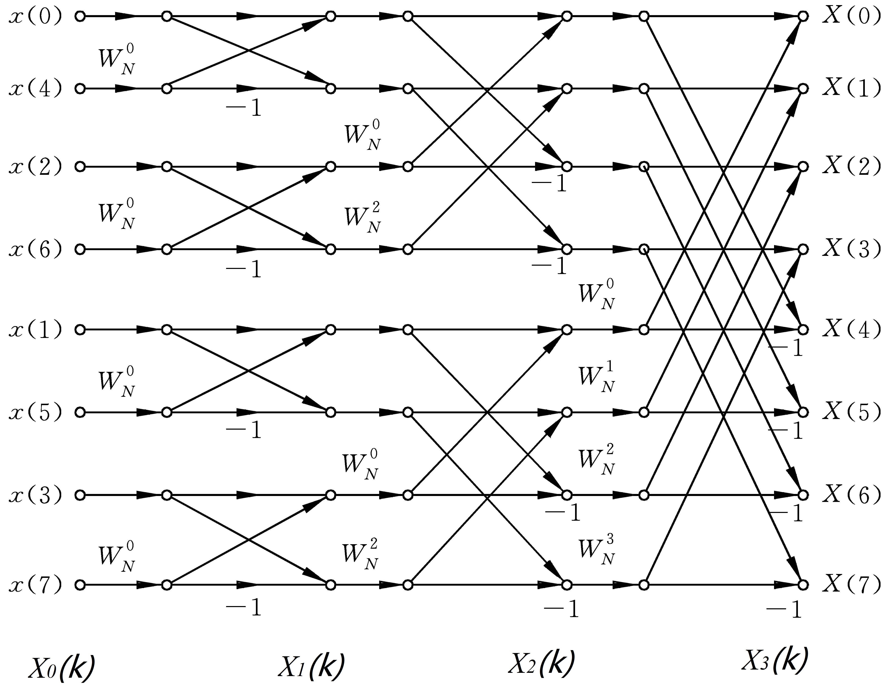
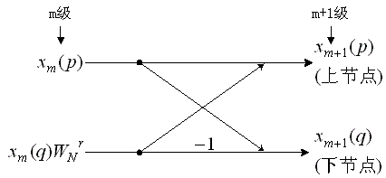

FFT设计
===

简介
---

FFT即快速傅里叶变换，是一种DFT（离散傅里叶变换）的高效算法。在以时频变换分析为基础的数字处理方法中，有着不可替代的作用。

### FFT原理

DFT的运算公式为：

\[
    X[k] = \sum^{N-1}_{n=0}x[n]W_{N}^{nk}, 0\le k\le N-1    
\]
其中，
\[
    W_N^{nk} = \mathrm{e}^{-j\frac{2\pi k}{N}n}
\]
将离散傅里叶变换公式拆分成奇偶项，则前$N/2$个点可以表示为：
\[
    \begin{aligned}
    X[k] &= \sum^{\frac{N}{n}-1}_{r=0}X[2r]W_{N}^{2rk} + \sum^{\frac{N}{2}-1}_{r=0}X[2r+1]W_{N}^{(2r+1)k}\\
    &= \sum^{\frac{N}{2}-1}_{r=0}X[2r]W^{rk}_{\frac{N}{2}} + W_N^k\sum^{\frac{N}{2}-1}_{r=0}X[2r+1]W^{rk}_{\frac{N}{2}}\\
    &= A[k] + W_N^kB[k], k=0,1,\cdots, \frac{N}{2}-1
   \end{aligned}
\]
同理，后$N/2$个点可以表示为：
\[
    X[k+N/2]=A[k]-W_N^kB[k], k = 0, 1, \cdots , \frac{N}{2}-1
\]

### 算法结构

8点FFT计算的结构示意图如下。

由图可知，只需要简单的几次乘法和加法，便可完成离散傅里叶变换过程，而不是对每个数据进行繁琐的相乘和相加。

### 重要特性

1. 级的概念
每分割一次，称为一级运算。设FFT运算点数为N，共有M级运算，则它们满足：
\[M=\log_2N\]
每一级运算的标识为$m=0,1,2,\cdots,M-1$。为了便于分割计算，FFT点数N的取值常常为2的整数次幂。
2. 蝶形单元
FFT计算结构由若干个蝶形运算单元组成，每个运算单元示意图如下：

蝶形单元的输入输出满足
\[
    x_{m+1}(p)=x_m(p)+x_m(q)W^r_N\\
    x_{m+1}(q)=x_m(p)-x_m(q)W^r_N    
\]
其中$q=p+2^m$
每一个蝶形单元运算时，进行了一次乘法和加法。每一级中，均有$N/2$个蝶形单元。故完成一次FFT所需要的乘法次数和加法次数分别为$N/2\cdot \log_2N$, $N\cdot\log_2N$
3. 组的概念
每一级$N/2$个蝶形单元可分为若干组，每一组有着相同的结构与$W^r_N$因子分布。
例如 m=0 时，可以分为 N/2=4 组。
m=1 时，可以分为 N/4=2 组。
m=M-1 时，此时只能分为 1 组。
4. $W^r_N$因子分布$W_{2^{m+1}}^r$存在于m级，其中$r=0,1,\cdots,2^m-1$。
5. 码位倒置
对于N=8的FFT计算，X(0)~X(7)位置对应的2进制码为：
\[X(000), X(001), X(010), X(011), X(100), X(101), X(110), X(111)\]
将其位置的二进制码进行翻转
\[X(000), X(100), X(010), X(110), X(001), X(101), X(011), X(111)\]
此时位置对应的十进制为：
\[X(0), X(4), X(2), X(6), X(1), X(5), X(3), X(7)\]
恰好对应FFT第一级输入数据的顺序。
该特性有利于FFT的编程实现。

## Verilog设计

### 设计说明

为了利用仿真简单的说明 FFT 的变换过程，数据点数取较小的值 8。

如果数据是串行输入，需要先进行缓存，所以设计时数据输入方式为并行。

数据输入分为实部和虚部共 2 部分，所以计算结果也分为实部和虚部。

设计采用流水结构，暂不考虑资源消耗的问题。

为了使设计结构更加简单，这里做一步妥协，乘法计算直接使用乘号。如果 FFT 设计应用于实际，一定要将乘法结构换成可以流水的乘法器，或使用官方提供的效率较高的乘法器 IP。

### 蝶形单元设计

蝶形单元为定点运算，需要对旋转因子进行定点量化。

借助 matlab 将旋转因子扩大 8192 倍（左移 13 位），可参考附录。

为了防止蝶形运算中的乘法和加法导致位宽逐级增大，每一级运算完成后，要对输出数据进行固定位宽的截位，也可去掉旋转因子倍数增大而带来的影响。 代码见参考。

### 顶层例化

根据 FFT 算法结构示意图，将蝶形单元例化，完成最后的 FFT 功能。

可根据每一级蝶形单元的输入输出对应关系，依次手动例化 12 次，也可利用 generate 进行例化，此时就需要非常熟悉 FFT 中"组"和"级"的特点：

1. 8 点 FFT 设计，需要 3 级运算，每一级有 4 个蝶形单元，每一级的组数目分别是 4、2、1。
2. 每一级的组内一个蝶形单元中两个输入端口的距离恒为$2^m$（m 为级标号，对应左移运算 1<<m），组内两个蝶形单元的第一个输入端口间的距离为 1。
3. 每一级相邻组间的第一个蝶形单元的第一个输入端口的距离为$2^{m+1}$（对应左移运算 2<<m）。

## 测试用例与参考输出

由于不同实现存在误差，这里的数据仅供参考。

| 序号 | X[0] | X[1] | X[2] | X[3] | X[4] | X[5] | X[6] | X[7] |
| ---- | ---- | ---- | ---- | ---- | ---- | ---- | ---- | ---- |
| 1    | 10   | 20   | 30   | 40   | 10   | 20   | 30   | 40   |

| 序号 | Y[0] | Y[1] | Y[2]    | Y[3] | Y[4] | Y[5] | Y[6]    | Y[7] |
| ---- | ---- | ---- | ------- | ---- | ---- | ---- | ------- | ---- |
| 1    | 200  | 0    | -40+40i | 0    | -40  | 0    | -40-40i | 0    |
### 参考代码

参见https://www.runoob.com/w3cnote/verilog-fft.html